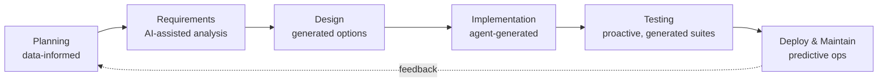
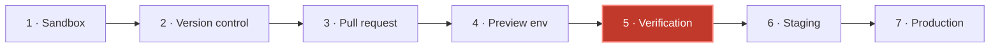
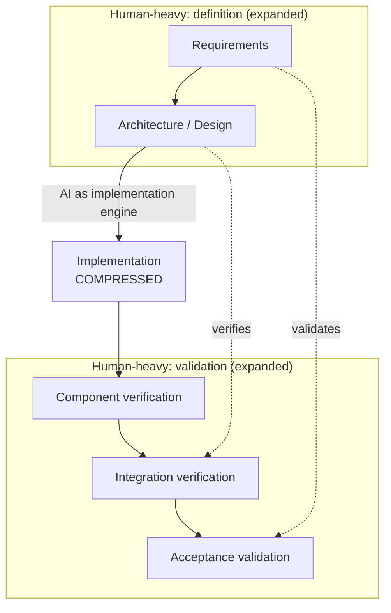

# AI SDLC

> Sources:
>
> - [Northflank — What is the AI SDLC?](https://northflank.com/blog/what-is-the-ai-sdlc)
> - [IBM — AI in the SDLC](https://www.ibm.com/think/topics/ai-in-sdlc)
> - [Infosys — AI-Native Software Development Lifecycle](https://www.infosys.com/iki/techcompass/ai-native-software-development-lifecycle.html)
> - [arXiv 2408.03416 — The AI-Native Software Development Lifecycle (V-Bounce model)](https://arxiv.org/abs/2408.03416)
> - [Augment Code — AI SDLC Framework: A CTO Reference Architecture](https://www.augmentcode.com/guides/ai-sdlc-framework-reference-architecture)

## What It Is

The software development life cycle for teams where **AI agents generate, modify, and test a significant share of the code** — and the process covers how that code is executed, reviewed, verified, deployed, and operated.

Not autocomplete in the editor. The lifecycle itself changes shape, because the constraint moves.

---

## Two Readings of the Term

### 1. AI-Native SDLC — the classic phases, with AI in each

The six phases from [001. SDLC](<001. SDLC.md>) stay. What happens inside them changes.

- Planning becomes more informed
- Development becomes more contextual
- Testing becomes more proactive
- Operations become more predictive

### 2. AI SDLC as a new pipeline — stages built around agent output

Agents produce code fast, so the bottleneck moves **downstream**: running agent-generated code safely, verifying it in realistic environments, promoting it to production.

| Stage                     | What happens                                          |
| ------------------------- | ----------------------------------------------------- |
| 1 · Sandboxed execution   | Isolated runtime: agent runs commands, deps, tests     |
| 2 · Version control       | Agent changes committed to Git for traceability        |
| 3 · Pull request          | Control point between agent output and team approval   |
| 4 · Preview environment   | Full-stack app spawned for review and QA               |
| **5 · Verification**      | **Real services, databases, jobs — not diffs alone**   |
| 6 · Staging               | Production-like environment for release checks         |
| 7 · Production and ops    | Controlled release, monitoring, scaling, rollback      |

---

## What Actually Changes

| Aspect          | Traditional                     | AI SDLC                                        |
| --------------- | ------------------------------- | ---------------------------------------------- |
| Code origin     | Developer's local machine       | Isolated sandbox / agent runtime               |
| Change volume   | Human-paced                     | Agent-accelerated, higher throughput           |
| Review focus    | Code diff                       | Running preview environment **plus** diff      |
| Verification    | CI checks and manual review     | CI checks **plus** live services and databases |
| Isolation needs | Trusted authors, shared runners | Untrusted code, strong runtime isolation       |

The row that matters: **isolation**. Traditional CI assumes the author is trusted. Agent-generated code is untrusted by default, so the sandbox is a security boundary, not a convenience.

---

## The V-Bounce Model (arXiv 2408.03416)

An adaptation of the traditional V-model with AI end to end.

Effort redistributes:

- **Expanded:** requirements gathering and architecture design
- **Compressed:** implementation time, dramatically, via AI
- **Continuous:** verification throughout, not only at the endpoints

Role shift:

- **Humans** move from _primary implementers_ to _validators and verifiers_
- **AI** becomes the _implementation engine_

Core claim: as AI capability matures, the current SDLC model becomes obsolete — human expertise concentrates on strategic decisions and quality assurance.

Some frameworks compress further, to two phases: **Design & Experiment**, then **Engineer & Scale**.

---

## Consequences for BA / DEV / QA

Against the role split in [002. SDLC BA DEV QA](<002. SDLC BA DEV QA.md>):

| Role    | What gets heavier                                                                                                      | What gets lighter                                              |
| ------- | ---------------------------------------------------------------------------------------------------------------------- | -------------------------------------------------------------- |
| **BA**  | Acceptance criteria become the agent's spec — vague criteria now produce wrong code fast, not just confused developers | Manual documentation drafting                                  |
| **DEV** | Architecture, review, verification design, sandbox and environment plumbing                                            | Line-by-line implementation, boilerplate, mechanical refactors |
| **QA**  | Environment realism, verification strategy, checking agent output at volume                                            | Manual regression clicking, test-case authoring from scratch   |

The handoff defects named in 002 do not disappear. They arrive faster.

---

## The One Thing to Remember

Generation is cheap now. **Verification is the bottleneck.** Every design decision in an AI SDLC should be judged by whether it makes verification cheaper, faster, or more trustworthy.
